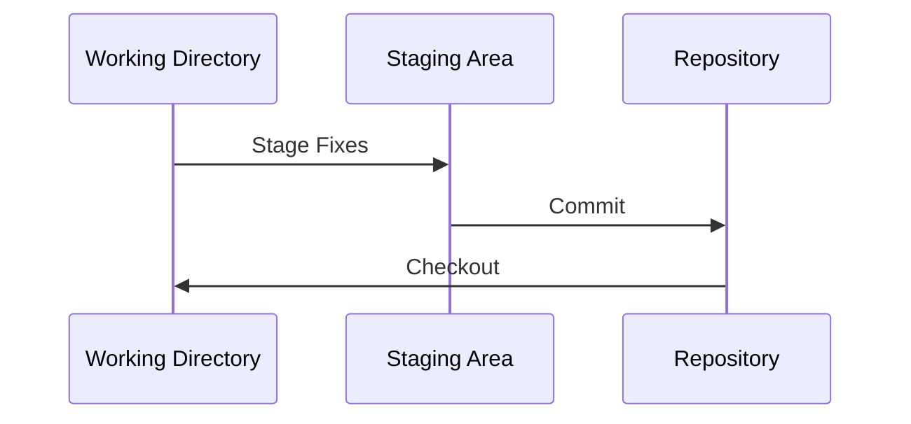
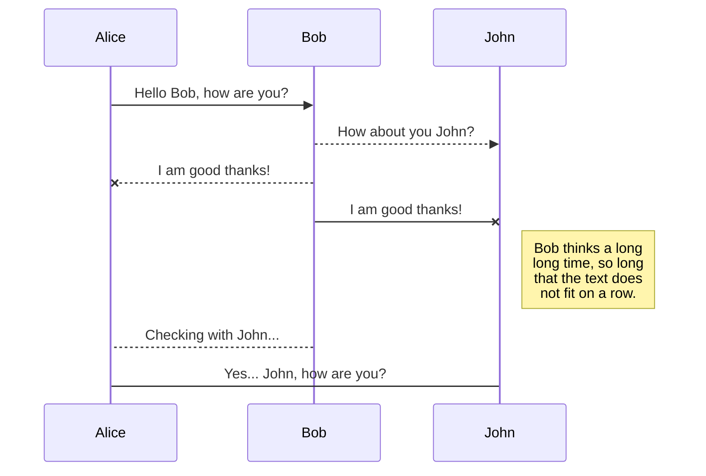

# As etapas das ALTERAÇÕES

> **Working directory** é o local onde os arquivos de navegação estão. Sua função é dar disponibilidade a seus arquivos para alterações na qual assim poderão ir ao **Staging Area**. Esse área, são locais que estão os arquivos adicionados (*git add*). Podemos então adicionar esses arquivos alterados ao repositório (*git commit -m "mensagem"*).

--- 

### Essas são as possibiliades entre Working Directory e Staged Area

---

<!--stackedit_data:
eyJoaXN0b3J5IjpbLTMxMzYwOTQwNywxMzYyMjEyODgxLDEzNj
IyMTI4ODEsLTc2MDA5NTA4Niw0Njk5OTUwMTgsLTYxMzEyNzM4
NiwxMTgzNzM0MTIyXX0=
-->